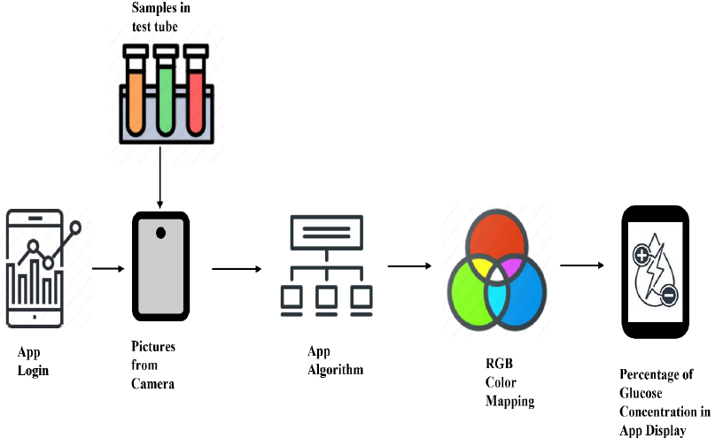
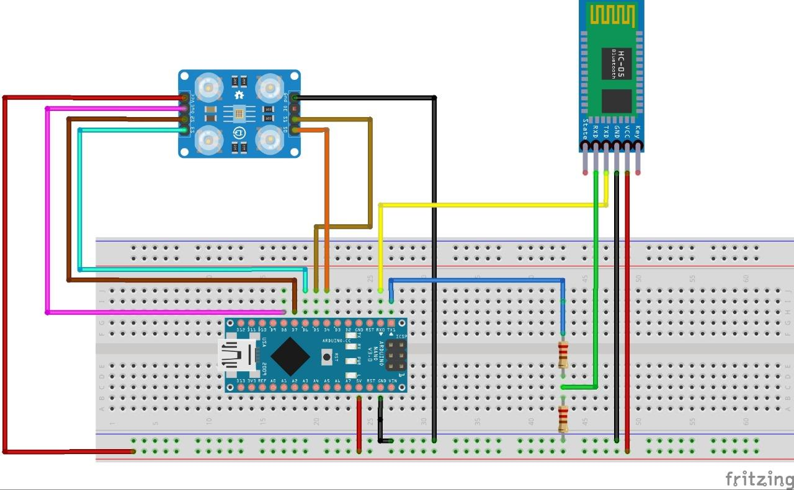

# Telechroma: A Smart Colorimetric Analyzer for Telemedicine Applications

**Project Title**: Telechroma  
**Project Team**: Team Telechroma  
**University**: Khulna University of Engineering & Technology (KUET)  
**Course**: BME 4232 Telemedicine & Health Care Laboratory
**Instructors**: Anik Ghosh, Amit Dutta Roy  
**Date**: 03-12-2023  

## Abstract

Telechroma is a portable, affordable, and easy-to-use colorimetric analyzer designed for telemedicine applications. It analyzes the concentration of biological analytes based on color changes in urine samples using colorimetric analysis. The data is then wirelessly transmitted via Bluetooth to a mobile app, enabling remote diagnostics and consultations. This device helps democratize healthcare, offering affordable diagnostic tests to patients in remote areas. It integrates hardware (Arduino Nano, TCS3200 Color Sensor, HC-05 Bluetooth Module) and software (MIT App Inventor mobile app) to create a comprehensive diagnostic solution.

## Features:
- **Portable and Affordable**: Compact design with cost-effective components
- **Real-time Data Transmission**: Wireless Bluetooth data transfer to mobile app
- **Smartphone App Integration**: Data displayed in real-time for healthcare professionals
- **Colorimetric Analysis**: Analyzes color changes in biological analytes (e.g., glucose in urine)
- **Dual Mode Operation**: Use either a dedicated colorimetric device or a smartphone camera for analysis

## Hardware Components:
- **Arduino Nano (V3.0)**: Microcontroller to process sensor data.
- **TCS3200 Color Sensor**: Measures color changes in biological samples.
- **Bluetooth HC-05 Module**: Wireless communication with the mobile app.
- **Breadboard & Wires**: For assembling the electronic components.

## Software Components:
- **Arduino IDE**: Code for Arduino microcontroller.
- **MIT App Inventor**: Used to build the Android mobile application for data display and communication.

## Installation

### Prerequisites:
1. **Arduino IDE** for uploading the firmware to the Arduino Nano.
2. **MIT App Inventor** to build and install the mobile app on Android devices.

### How to Use:
1. **Hardware Setup**: 
   - Connect the TCS3200 color sensor and Bluetooth module to the Arduino Nano.
   - Power the device via USB or a 9V battery.
   
2. **Mobile App Setup**: 
   - Download and install the mobile app (link to be provided if shared in the project).
   - Pair the smartphone with the Telechroma device via Bluetooth.
   - Launch the app and select either "Using Device" or "Using Camera" mode.

3. **Testing**: 
   - Perform colorimetric tests on biological samples (e.g., urine) and record the color data.
   - The app will display the concentration of analytes based on color matching.

## Results and Discussion:
- **Accuracy**: In device mode, accuracy was 100%, while in camera mode it was 80%.
- **Challenges**: The Bluetooth module initially exhibited instability, which was resolved by enhancing the connections. The mobile app interface also required several updates to improve functionality.

## Future Work:
- Integration with advanced sensors like Raspberry Pi and spectrometer modules.
- Enhancements to the mobile app for a more user-friendly experience.
- Expanding the range of analytes that can be detected.

## License:
This project is licensed under the MIT License - see the [LICENSE](LICENSE) file for details.

## References:
1. Deepak Pathania et al., "Telemedicine," Springer Handbook of Medical Technology, 2022.
2. Dae-Sik Lee et al., "A simple and smart telemedicine device for developing regions: a pocket-sized colorimetric reader," Lab on a Chip, 2011.
3. MIT App Inventor documentation: https://www.mit.edu/app-inventor.
